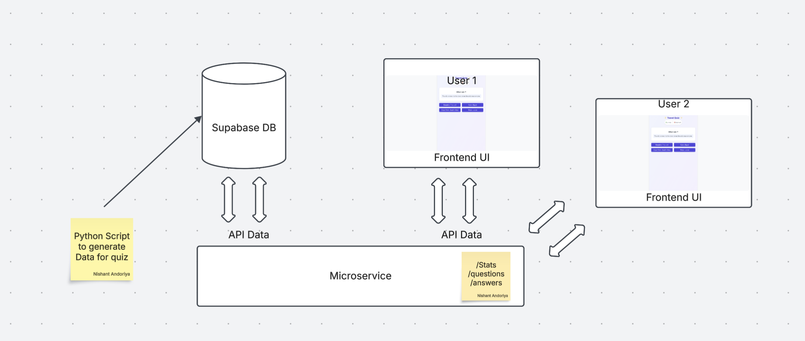

# Travel Quiz Game - System Design & Implementation

##  Overview
The **Travel Quiz Game** is an interactive web application where users guess destinations based on clues. It integrates AI-generated data, a microservices backend, and caching for optimal performance. The game provides immediate feedback, tracks scores, and ensures secure data storage.

## Desgin Overview

## Features
- **Dynamic AI-Generated Dataset**: Uses OpenAI APIs to generate trivia, fun facts, and clues for 100+ destinations.
- **Interactive Gameplay**:
  - Users receive 1–2 random clues per round.
  - Select from multiple possible answers.
  - Get instant feedback with animations (Confetti for correct, Sad-face for incorrect).
  - View fun facts after answering.
  - "Play Again" button to load a new question.
  - Tracks total correct and incorrect answers.
- **Efficient Backend with Caching**: Uses Redis for fast retrieval and Supabase as the primary database.

## System Architecture
### 1️⃣ **Frontend**
- Built with **React**.
- Communicates with the backend via REST APIs.
- Displays questions dynamically and handles user interactions.

### 2️⃣ **Backend**
- Developed in **Python**.
- Implements a **microservices architecture**.
- Exposes three endpoints:
  1. **`/stats`**: Returns the count of available cities in the dataset.
  2. **`/question`**: Fetches a random question for the user.
  3. **`/answer`**: Accepts the question ID and user's selected answer ID, validates the response, and returns feedback.

### 3️⃣ **Data Storage & Retrieval**
- **Database**: Supabase (PostgreSQL) stores all destination data.
- **Caching Layer**: Redis speeds up question retrieval to minimize database hits.

### 4️⃣ **Data Generation**
- A Python script uses OpenAI APIs to generate and store trivia, fun facts, and clues in Supabase.

## Performance Optimization
- **Redis Caching**: Reduces database queries by storing frequently accessed questions.
- **Asynchronous API Calls**: Ensures smooth user experience without blocking UI using FASTAPI as backend.

## Security Considerations
- **Backend Validation**: Users cannot peek into source code for answers since all data is retrieved via backend APIs.
- **Rate Limiting**: Prevents abuse of endpoints.
- **Secure API Keys**: Environment variables store sensitive information.

---
This project effectively combines AI-powered data generation, a microservices backend, and frontend interactivity to create an engaging travel quiz experience! 🌍🎮

